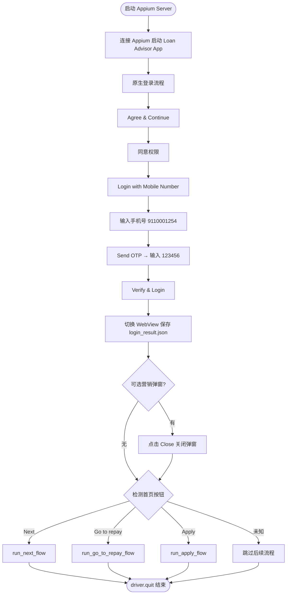
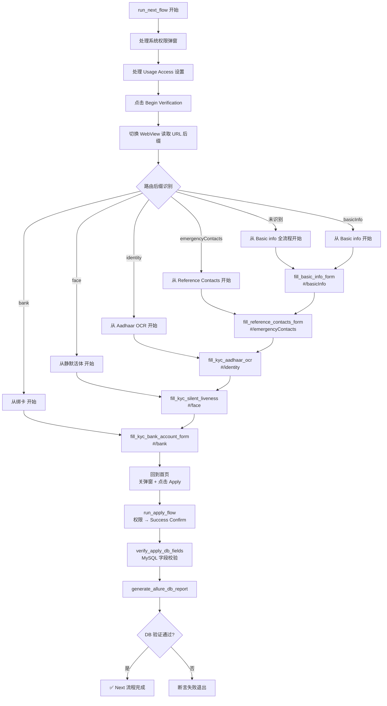
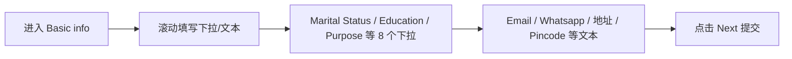
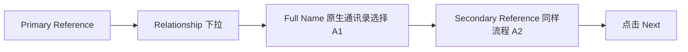
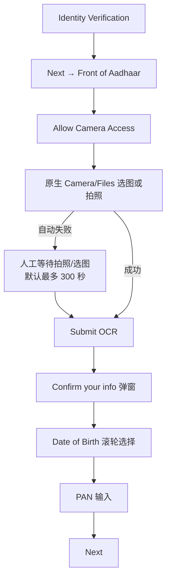
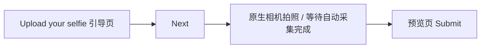
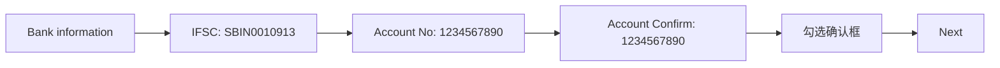
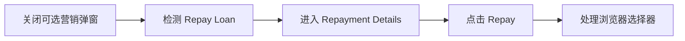
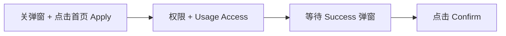

# Loan Advisor Appium 自动化测试 — 业务流程图与使用说明

> 基于脚本：`appium自动化测试_备份.py`  
> 应用包名：`com.rajwiseguide.loanadvisor.app`  
> 文档更新日期：2026-07-03

---

## 目录

1. [总体业务流程图](#一总体业务流程图)
2. [Next 流程（KYC 主链路）](#二next-流程kyc-主链路)
3. [KYC 各子流程详图](#三kyc-各子流程详图)
4. [其他分支流程](#四其他分支流程)
5. [业务使用说明](#五业务使用说明)

---

## 一、总体业务流程图



---

## 二、Next 流程（KYC 主链路）

适用于首页出现 **Next** 按钮、用户处于资料/KYC 未完成阶段。



### 智能续跑逻辑

脚本会根据 **Begin Verification** 后当前 H5 URL 后缀，**跳过已完成步骤**，只执行当前页及后续 KYC 步骤。

| URL 后缀 | 起始步骤 | 自动续跑 |
|---------|---------|---------|
| `#/basicInfo` | Basic info | → 紧急联系人 → OCR → 活体 → 绑卡 |
| `#/emergencyContacts` | Reference Contacts | → OCR → 活体 → 绑卡 |
| `#/identity` | Aadhaar OCR | → 活体 → 绑卡 |
| `#/face` | 静默活体 | → 绑卡 |
| `#/bank` | 绑卡 | 仅绑卡 |

### KYC 步骤与函数对照

| 序号 | H5 路由 | 函数名 | 页面标题 |
|------|---------|--------|---------|
| 1 | `basicInfo` | `fill_basic_info_form` | Basic info |
| 2 | `emergencyContacts` | `fill_reference_contacts_form` | Reference Contacts |
| 3 | `identity` | `fill_kyc_aadhaar_ocr` | Identity Verification |
| 4 | `face` | `fill_kyc_silent_liveness` | Upload your selfie |
| 5 | `bank` | `fill_kyc_bank_account_form` | Bank information |

---

## 三、KYC 各子流程详图

### 3.1 Basic info（`#/basicInfo`）



**填写字段（脚本内置测试数据）：**

| 类型 | 字段 | 测试值 |
|------|------|--------|
| 下拉 | Marital Status | Single |
| 下拉 | Education Level | PHD |
| 下拉 | Purpose of Loan | Rent |
| 文本 | Email ID | testauto123@gmail.com |
| 文本 | Whatsapp | 9811543210 |
| 文本 | Street address | Flat 5, Green Heights, MG Road |
| 文本 | Town/City | Mumbai |
| 下拉 | State | Bihar |
| 文本 | Pincode | 560001 |
| 下拉 | Employment Type | Student |
| 下拉 | Work Experience | Over 2 Year |
| 下拉 | Salary Credit Day | 1 |
| 下拉 | Monthly Income | ₹0–10,000 |

---

### 3.2 Reference Contacts（`#/emergencyContacts`）



**填写逻辑：**

- Primary / Secondary 各填一组：Relationship（father/mother）+ Full Name（通讯录第 1/2 条）
- 已填字段自动跳过，支持上滑查找

---

### 3.3 Aadhaar OCR（`#/identity`）



**拍照/选图容错：**

- 自动拍照/选图失败时，脚本进入**人工等待模式**（环境变量 `KYC_PHOTO_MANUAL_WAIT_SEC`，默认 300 秒）
- 检测到预览页 **Submit** 出现后，自动继续 OCR 与 Confirm 表单填写
- 相关截图：`kyc_photo_fail.png`、`kyc_photo_manual_wait.png`

**OCR 确认弹窗测试数据（`KYC_OCR_TEST_DATA`）：**

| 字段 | 测试值 |
|------|--------|
| Full Name | Mohammed Saif Farooqi（OCR 已有则跳过） |
| Date of Birth | 31/07/2000（滚轮选择，非文本输入） |
| PAN card number | ABCDE1234F |

---

### 3.4 静默活体（`#/face`）



**说明：**

- 优先等待静默活体自动完成并回到 WebView 预览页
- 超时后尝试点击原生相机快门作为兜底

---

### 3.5 绑卡（`#/bank`）



**绑卡测试数据（`KYC_BANK_TEST_DATA`）：**

| 字段 | 测试值 |
|------|--------|
| IFSC code | SBIN0010913 |
| Account No. | 1234567890 |
| Account No. confirmation | 1234567890 |

---

## 四、其他分支流程

### 4.1 Go to repay（`run_go_to_repay_flow`）



**触发条件：** 首页检测到 **Go to repay** 按钮（点击前会先关可选弹窗）。

**可选弹窗（非必现）：** 标题 *Plan your next loan with one click*，点击 **Close** 关闭（勿点 Start now）。

---

### 4.2 Apply（`run_apply_flow`）



**触发条件：**

- 首页检测到 **Apply** 按钮时单独执行（点击前会先关可选弹窗）
- **Next 流程** KYC 全部完成后回到首页，由 `click_home_apply_if_needed` **关弹窗并点击 Apply**，再进入 `run_apply_flow`

---

## 五、业务使用说明

### 1. 脚本用途

本脚本用于 **Loan Advisor Android App** 的端到端自动化测试，覆盖：

- 原生登录（OTP）
- H5 WebView KYC 全流程（Basic info → 紧急联系人 → Aadhaar OCR → 静默活体 → 绑卡）
- 申请成功确认（Apply）
- 还款入口操作（Go to repay）
- MySQL 数据库字段落库验证 + Allure 报告

---

### 2. 环境准备

| 项目 | 要求 |
|------|------|
| Appium Server | `http://127.0.0.1:4723` 已启动 |
| Android 设备 | 已 USB 连接，与脚本中 `deviceName` 配置一致 |
| ChromeDriver | 路径：`G:\chromedriver\chromedriver-win64\chromedriver.exe` |
| Python 依赖 | `appium-python-client`、`selenium`、`pymysql` 等 |
| 网络 | 设备可访问 H5 服务（如 `192.168.31.217:7066`） |
| MySQL | 脚本内 `APPLY_DB_CONFIG` 可连通（Next 流程 DB 验证用） |

---

### 3. 运行方式

1. 启动 Appium Server
2. 连接测试手机，确保 Loan Advisor App 可正常启动
3. 在项目目录执行：

```bash
python appium自动化测试_备份.py
```

4. 脚本自动完成登录，并根据首页按钮分支执行：

| 首页按钮 | 执行函数 | 说明 |
|---------|---------|------|
| **Next** | `run_next_flow` | KYC 全流程 → 关弹窗点 Apply → DB 验证 |
| **Go to repay** | `run_go_to_repay_flow` | 关弹窗 → 还款流程 |
| **Apply** | `run_apply_flow` | 关弹窗点 Apply → Success Confirm |

登录后、点击首页按钮前，若出现 **Plan your next loan with one click** 弹窗，脚本会自动点击 **Close**（非必现）。

---

### 4. 登录测试账号（脚本内置）

| 字段 | 值 |
|------|-----|
| 手机号 | `9110001254` |
| OTP | `123456` |

登录成功后写入 `login_result.json`，含 `customerId`、`localStorage` 等，供 DB 验证使用。

---

### 5. 断点续跑（Next 流程）

若 KYC 中途失败或账号已部分完成资料：

1. 再次运行脚本并完成登录
2. 首页点击 **Next** → **Begin Verification**
3. 脚本读取当前 WebView URL 后缀，**从对应步骤继续**，无需手动修改代码

**示例：** 当前 URL 为 `#/face`，脚本自动跳过 Basic info、紧急联系人、OCR，从静默活体开始，完成后继续绑卡。

---

### 6. 输出物

| 输出 | 说明 |
|------|------|
| 控制台日志 | 各步骤 ✅ / ⚠️ 状态 |
| 截图 | 如 `kyc_step*.png`、`kyc_bank_*.png`、`optional_loan_popup_*.png`、`before_click_apply.png` 等 |
| `login_result.json` | 登录 token / customerId |
| `allure-results/` | DB 验证原始结果 |
| `allure-report/` | Allure HTML 报告（需本机安装 allure CLI） |

**生成 Allure HTML 报告（手动）：**

```bash
allure generate allure-results -o allure-report --clean
```

---

### 7. DB 验证范围（Next 流程）

`verify_apply_db_fields` 校验以下表字段非空：

| 表名 | 校验字段 |
|------|---------|
| `customer` | market_id, customer_mobile, gad_id |
| `customer_ext` | andriod_id, fcm_app_instance_id, fcm_app_token |
| `customer_ext_part2` | ad_id, quite_photo_url, quite_photo_check_liveness |
| `customer_device_info` | base_info_address_url, app_address_url, call_address_url, app_use_address_url, gps_address_url |

- 最多重试 **15** 次，间隔 **5** 秒（等待后端异步落库）
- 数据库连接配置见脚本 `APPLY_DB_CONFIG`

---

### 8. 技术架构

```
┌─────────────────────────────────────────┐
│           NATIVE_APP（原生层）            │
│  登录 / 权限 / 相机 / 通讯录 / Usage Access │
└─────────────────┬───────────────────────┘
                  │ context 切换
┌─────────────────▼───────────────────────┐
│  WEBVIEW_com.rajwiseguide.loanadvisor     │
│  H5 表单：basicInfo / identity / bank…    │
└─────────────────┬───────────────────────┘
                  │ 提交后
┌─────────────────▼───────────────────────┐
│         MySQL + Allure 验证报告           │
└─────────────────────────────────────────┘
```

**Context 切换说明：**

- **NATIVE_APP**：登录、系统权限、原生相机、通讯录选择
- **WEBVIEW**：H5 表单填写、下拉、日期选择器、Submit/Next 按钮

---

### 9. 常见问题

| 现象 | 可能原因 | 建议 |
|------|---------|------|
| 首页按钮点不到 | 营销弹窗遮挡 | 查看 `optional_loan_popup_*.png`，确认 Close 已点击 |
| KYC 后未进入 Apply | 未点击首页 Apply | 查看 `before_click_apply.png`，确认 Apply 按钮可见 |
| Aadhaar 拍照卡住 | 自动选图失败 | 人工完成拍照后等待脚本检测 Submit；可调 `KYC_PHOTO_MANUAL_WAIT_SEC` |
| WebView 切换失败 | H5 未加载完 / 网络问题 | 检查 `#/xxx` 页面是否可访问 |
| 下拉/日期选择器点不开 | 键盘遮挡 / 元素未滚动到可见区 | 查看截图，确认 WebView context |
| PAN/银行卡重复填写 | JS + send_keys 双写 | 查看 `kyc_pan_fill_fail.png` 等截图 |
| DOB Confirm 未生效 | 滚轮未真正关闭 | 查看 `kyc_dob_confirm_fail.png` |
| DB 验证失败 | 后端异步写入慢 | 检查 MySQL 连通，或增大重试次数 |
| 静默活体卡住 | 相机权限 / 未回到预览页 | 查看 `kyc_liveness_*.png` |
| Usage Access 未开启 | 系统设置页未找到开关 | 手动开启后重跑 |

---

### 10. 关键函数索引

| 函数 | 作用 |
|------|------|
| `switch_to_real_webview` | 切换到有效 WebView |
| `click_home_target_with_optional_popup` | 关弹窗后点击 Next / Go to repay / Apply |
| `dismiss_optional_home_loan_popup` | 关闭可选营销弹窗 |
| `click_home_apply_if_needed` | KYC 完成后关弹窗并点击 Apply |
| `run_kyc_steps_from_route` | 按路由后缀续跑 KYC |
| `fill_basic_info_form` | 填写 Basic info |
| `fill_reference_contacts_form` | 填写紧急联系人 |
| `fill_kyc_aadhaar_ocr` | Aadhaar OCR + 确认信息（含人工拍照兜底） |
| `fill_kyc_silent_liveness` | 静默活体检测 |
| `fill_kyc_bank_account_form` | 绑卡 |
| `run_apply_flow` | 点 Apply → Success Confirm |
| `verify_apply_db_fields` | MySQL 落库验证 |
| `generate_allure_db_report` | 生成 Allure 报告 |

---

*本文档由自动化脚本结构整理生成，如有流程变更请同步更新此文档。*
